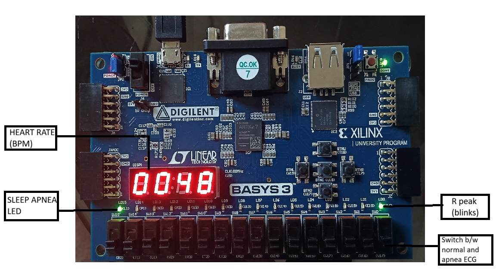

# FPGA-Based Real-Time ECG Sleep Apnea Detection System

## Overview
This project implements a real-time ECG signal processing system on FPGA (Basys-3) for hardware-based detection of apnea-like patterns. The design performs R-peak detection, RR interval computation, and statistical analysis over a fixed 60-second evaluation window.

Two preloaded ECG datasets (Normal and Apnea) are stored in on-chip Block Memory and can be switched at runtime using switch.

---

## System Architecture

- 100 Hz sampling from 100 MHz clock
- Block Memory Generator IP (COE initialization)
- R-Peak Detection
- RR Interval Computation
- Variance & Irregularity Scoring
- 60-Second Evaluation Window
- Runtime Dataset Switching with Synchronized Reset
- Real-Time BPM Display
- Apnea indication using LED
---

## Key Features

- Fully synchronous modular Verilog design
- Dual dataset comparison (Normal vs Apnea)
- Deterministic time-window processing
- Hardware-based statistical feature extraction
- MATLAB cross-validation of RR and variance metrics

---

## Tools & Technologies

- Verilog HDL
- Xilinx Vivado
- Block Memory Generator IP
- MATLAB (Algorithm Cross-Validation)

---

## Hardware Implementation (Basys-3 FPGA)

<p align="center">
  
</p>

## Demo

[▶ Watch Demo Video](https://youtu.be/dpcdm0rQXas)

---

## Folder Structure

```
FPGA-ECG-Apnea-Detection/
│
├── src/
│ ├── TOP.v # Top-level system integration module
│ ├── apnea_detection.v # Apnea classification logic
│ ├── apnea_ecg_rom.v # Apnea ECG ROM wrapper
│ ├── RR_interval.v # RR interval computation
│ ├── ecg_rom.v # Normal ECG ROM wrapper
│ ├── r_peak_detector.v # R-peak detection module
│
├── data/
│ ├── ecg_rom.coe # ECG dataset (COE format)
│ ├── normal_ecg_rom.coe # Normal ECG dataset (COE format)
│
└── README.md
```
## Results

- Accurate R-peak detection with real-time heartbeat LED blinking
- Correct RR interval computation over continuous ECG samples
- Stable 60-second time-window evaluation for apnea classification
- Apnea LED activates for apnea dataset and remains OFF for normal dataset
- Runtime dataset switching without FPGA reprogramming
- Deterministic reset behavior with no false triggering
- Cross-validation of RR intervals and statistical metrics using MATLAB prior to hardware deployment
- Real-time BPM display using multiplexed 7-segment output
---
